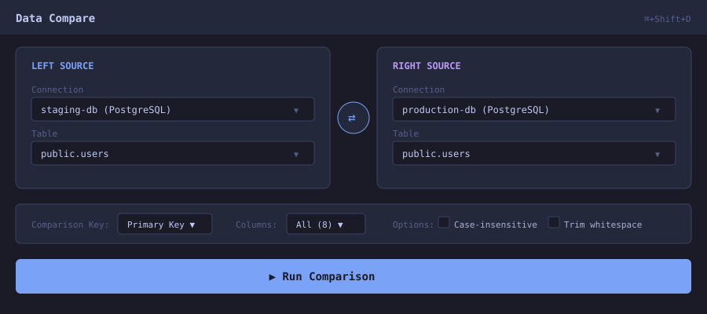
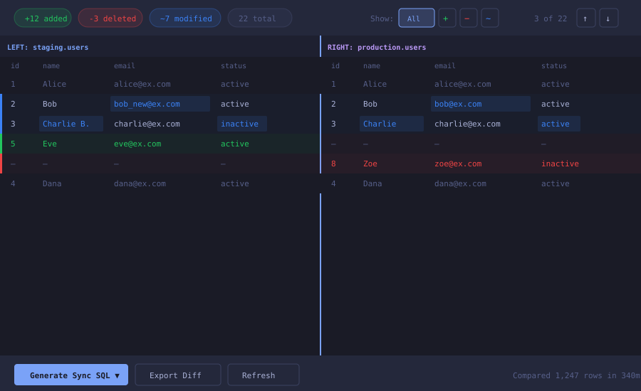
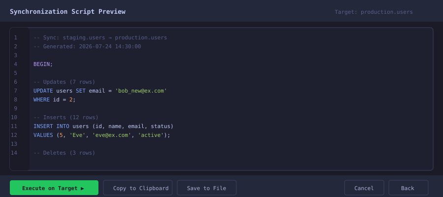
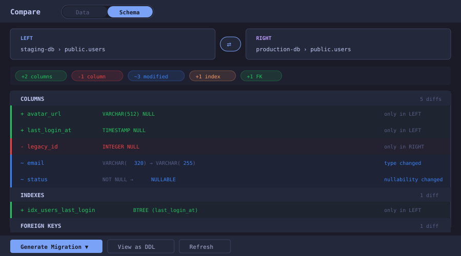
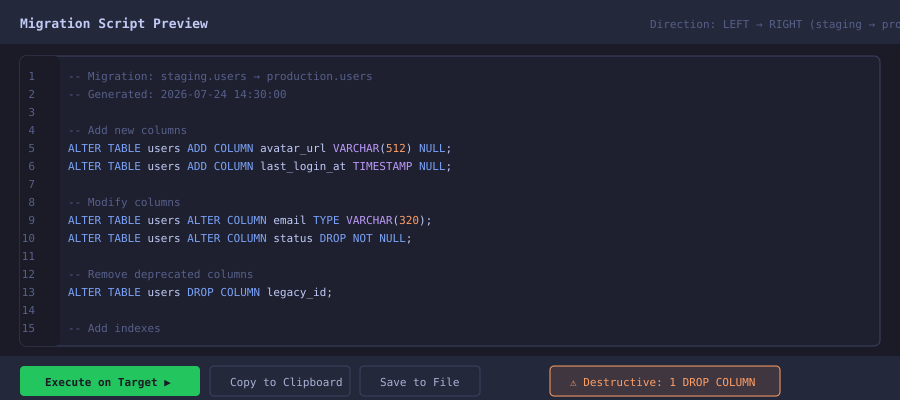

# Compare & Diff Tool — Feature Planning Document

## Executive Summary

A unified comparison tool for Tabularis with two modes: **Data Compare** (row-level differences between tables/query results) and **Schema Compare** (structural DDL differences — columns, indexes, foreign keys, triggers). Both modes share the same UI shell (source/target selectors, summary bar, sync script generation) with mode-specific results views. The feature integrates naturally with the existing multi-connection architecture and reuses established UI patterns.

---

## Table of Contents

1. [Motivation & Use Cases](#motivation--use-cases)
2. [Architecture Decision](#architecture-decision)
3. [Feature Scope (MVP → Full)](#feature-scope)
4. [UX Workflow](#ux-workflow)
5. [Visual Design & Mockups](#visual-design--mockups)
6. [Schema Comparison Design](#schema-comparison-design)
7. [Technical Architecture](#technical-architecture)
8. [Package Requirements](#package-requirements)
9. [Driver Abstraction & Multi-Database Considerations](#driver-abstraction--multi-database-considerations)
10. [Cross-Platform (OS) Considerations](#cross-platform-os-considerations)
11. [Safety & Permissions](#safety--permissions)
12. [Row Ordering & Sorting](#row-ordering--sorting)
13. [Composite Key Handling](#composite-key-handling)
14. [Value Serialization in Sync Scripts](#value-serialization-in-sync-scripts)
15. [Live vs. Snapshot Semantics](#live-vs-snapshot-semantics)
16. [Connection Error Handling](#connection-error-handling)
17. [Partial Sync Selection](#partial-sync-selection)
18. [Accessibility](#accessibility)
19. [Nuances & Constraints](#nuances--constraints)
20. [Data Model](#data-model)
21. [Backend Considerations](#backend-considerations)
22. [Testing Strategy](#testing-strategy)
23. [Phased Implementation Plan](#phased-implementation-plan)
24. [Open Questions for Discussion](#open-questions-for-discussion)

---

## Motivation & Use Cases

| Use Case | Mode | Example |
| ---------- | ------ | --------- |
| **Staging vs. Production data** | Data | Compare `staging.users` against `prod.users` to see what will change on deploy |
| **Migration validation** | Data | After migrating data, confirm source and target match |
| **Drift detection** | Data | Check if two replicas have diverged |
| **Query result comparison** | Data | Compare results of two queries (e.g., before/after an optimization) |
| **Table versioning** | Data | Compare a table's current state against a snapshot/backup |
| **Cross-database sync** | Data | Generate INSERT/UPDATE/DELETE scripts to synchronize tables |
| **Schema drift detection** | Schema | Compare staging and production table structure after a deploy |
| **Migration script generation** | Schema | Generate ALTER TABLE statements to evolve production schema |
| **PR review aid** | Schema | See exactly what columns/indexes a migration adds or removes |
| **Multi-environment audit** | Schema | Verify all environments have identical table structures |
| **Refactoring validation** | Schema | After renaming columns or changing types, confirm nothing was missed |

---

## Architecture Decision

### Recommended: New Tab Type + Pop-Out Window

The compare feature should live as a **new tab type (`"compare"`)** within the Editor, with the ability to **pop out into a standalone window** for focused work.

**Why this hybrid approach:**

| Factor | Tab Type | Standalone Page | Hybrid (Recommended) |
| -------- | ---------- | ----------------- | --------------------- |
| Access to sidebar (table list) | ✅ | ❌ | ✅ |
| Full-screen focus mode | ❌ | ✅ | ✅ |
| Multi-connection context | ✅ | Needs custom | ✅ |
| Fits existing workflow | ✅ | Separate UX | ✅ |
| Can be opened from context menu | ✅ | ✅ | ✅ |
| State persistence with tabs | ✅ | ❌ | ✅ |

**Integration points:**

- Right-click a table in the Explorer → "Compare with..."
- Editor toolbar button → "New Compare Tab"
- Keyboard shortcut (e.g., `Cmd+Shift+D`)
- Compare tab can be "popped out" to a standalone window like results-window

---

## Feature Scope

### MVP (Phase 1) — Data Compare

- Compare two tables on the **same connection** by primary key
- Side-by-side grid showing differences (added, removed, modified rows)
- Cell-level highlighting of changed values
- Filter by change type (inserts / updates / deletes / all)
- Summary statistics bar
- Basic column mapping (automatic by name)

### Phase 2 — Schema Compare + Cross-Connection

- **Schema comparison mode** (columns, types, nullability, defaults, indexes, FKs)
- Mode toggle in the compare tab header (Data ↔ Schema)
- Compare across **different connections** (staging vs. prod)
- Custom comparison key (not just PK) for data mode
- Generate SQL sync scripts:
  - Data mode: INSERT/UPDATE/DELETE
  - Schema mode: ALTER TABLE, CREATE/DROP INDEX, ADD/DROP CONSTRAINT
- Monaco DiffEditor for individual cell text comparison (data) and DDL view (schema)
- Export diff results (CSV, JSON, SQL)
- Destructive operation warnings (DROP COLUMN, etc.)

### Phase 3 — Advanced Features

- Query-to-query comparison (arbitrary SELECT results)
- Schema diff for **multiple tables at once** (compare entire schemas)
- Views, triggers, stored procedures comparison
- Bidirectional sync with conflict resolution
- Scheduled/automated comparisons
- Chunk-based comparison for large tables (hash-first, then drill-down)
- Pop-out to standalone window
- Comparison history (save configs for quick re-runs)

---

## UX Workflow

```text
┌───────────────────────────────────────────────────────────┐
│  1. SETUP                                                 │
│  ┌──────────────────┐      ┌──────────────────┐           │
│  │  Left Source     │  ←→  │  Right Source    │  [Swap]   │
│  │  Connection: ... │      │  Connection: ... │           │
│  │  Table: ...      │      │  Table: ...      │           │
│  │  Filter: WHERE.. │      │  Filter: WHERE.. │           │
│  └──────────────────┘      └──────────────────┘           │
│                                                           │
│  Comparison Key: [PK ▼]  Columns: [All / Select...]       │
│                                                           │
│  [Compare]                                                │
├───────────────────────────────────────────────────────────┤
│  2. RESULTS                                               │
│  ┌──────────────────────────────────────────────────┐     │
│  │ Summary:  +12 added  -3 deleted  ~7 modified     │     │
│  │ Filter: [All ▼] [Show identical: ☐]              │     │
│  └──────────────────────────────────────────────────┘     │
│  ┌──────────────────────┬───────────────────────────┐     │
│  │  LEFT (staging)      │  RIGHT (production)       │     │
│  ├──────────────────────┼───────────────────────────┤     │
│  │  id=1  name="Alice"  │  id=1  name="Alice"       │     │
│  │  id=2  name="Bob"    │  id=2  name="Robert" ←mod │     │
│  │  id=5  name="Eve" →+ │  (missing)                │     │
│  │  (missing)           │  id=8  name="Zoe" →del    │     │
│  └──────────────────────┴───────────────────────────┘     │
├───────────────────────────────────────────────────────────┤
│  3. ACTIONS                                               │
│  [Generate Sync SQL ▼]  [Export Results]  [Copy Script]   │
└───────────────────────────────────────────────────────────┘
```

---

## Visual Design & Mockups

### Mockup 1: Compare Setup Panel



### Mockup 2: Comparison Results View



### Mockup 3: Sync Script Preview



---

## Schema Comparison Design

### Mode Toggle

The compare tab has a **Data / Schema** toggle in its header. Both modes share the same source/target selection UI. Switching modes preserves the selected connections and tables — only the results view changes.

### What Schema Mode Compares

| Object | Comparison Points |
| -------- | ------------------- |
| **Columns** | Name, data type, length/precision, nullability, default value, auto-increment |
| **Indexes** | Name, type (BTREE/HASH/GIN/etc.), columns, uniqueness, partial predicate |
| **Foreign Keys** | Name, columns, referenced table, ON DELETE/UPDATE actions |
| **Primary Key** | Column composition changes |
| **Constraints** | CHECK constraints, UNIQUE constraints |
| **Triggers** (Phase 3) | Name, timing, event, body |
| **Views** (Phase 3) | Definition (DDL diff via Monaco DiffEditor) |

### Schema Diff Result Categories

- **Added** (green) — exists in LEFT, not in RIGHT
- **Removed** (red) — exists in RIGHT, not in LEFT
- **Modified** (blue) — exists in both but properties differ (shows old → new)
- **Identical** (hidden by default) — structure matches exactly

### Mockup 4: Schema Compare Results



### Mockup 5: Schema Migration Script



### Sync Script Generation (Schema Mode)

Schema mode generates **migration DDL** instead of DML:

| Diff Type | Generated SQL |
| ----------- | --------------- |
| Column added | `ALTER TABLE t ADD COLUMN col TYPE ...` |
| Column removed | `ALTER TABLE t DROP COLUMN col` |
| Column type changed | `ALTER TABLE t ALTER COLUMN col TYPE new_type` |
| Nullability changed | `ALTER TABLE t ALTER COLUMN col SET/DROP NOT NULL` |
| Default changed | `ALTER TABLE t ALTER COLUMN col SET DEFAULT ...` |
| Index added | `CREATE INDEX idx ON t (cols)` |
| Index removed | `DROP INDEX idx` |
| FK added | `ALTER TABLE t ADD CONSTRAINT fk FOREIGN KEY ...` |
| FK removed | `ALTER TABLE t DROP CONSTRAINT fk` |

**Safety features:**

- Destructive operations (DROP COLUMN, DROP INDEX) get a **⚠ warning badge**
- Script wrapped in a transaction (`BEGIN; ... COMMIT;`) by default
- Option to generate as "up + down" migrations for reversibility
- Dialect-aware DDL (PostgreSQL vs MySQL vs SQLite syntax differences)

### Existing Backend Support

The app already has Tauri commands for all needed schema introspection:

```text
get_columns(connection_id, table_name, schema) → Vec<TableColumn>
get_indexes(connection_id, table_name, schema) → Vec<Index>
get_foreign_keys(connection_id, table_name, schema) → Vec<ForeignKey>
get_tables(connection_id, schema) → Vec<TableInfo>
```

The `TableColumn` struct already includes: `name`, `data_type`, `is_nullable`, `is_pk`, `is_auto_increment`, `column_default`, `character_maximum_length`. This is sufficient for column-level comparison without any new backend commands.

---

## Technical Architecture

### Component Tree

```text
App.tsx
└── MainLayout
    └── Editor.tsx
        └── CompareTab (when activeTab.type === "compare")
            ├── CompareHeader (mode toggle: Data / Schema)
            ├── CompareSetupPanel
            │   ├── SourceSelector (left)
            │   ├── SourceSelector (right)
            │   └── CompareOptionsBar (mode-specific options)
            │
            ├── [Data Mode] CompareDataView
            │   ├── CompareSummaryBar (row stats)
            │   ├── CompareDiffGrid (side-by-side virtual grid)
            │   │   ├── Uses @tanstack/react-virtual
            │   │   ├── Side-by-side column layout
            │   │   └── Cell-level diff highlighting
            │   └── CompareNavigation (prev/next diff)
            │
            ├── [Schema Mode] CompareSchemaView
            │   ├── CompareSummaryBar (schema object stats)
            │   ├── SchemaObjectList (grouped: columns, indexes, FKs)
            │   │   ├── SchemaDiffSection (collapsible per object type)
            │   │   └── SchemaDiffRow (individual change)
            │   └── CompareNavigation (prev/next diff)
            │
            └── SyncScriptPanel (shared, adapts to mode)
                ├── Monaco Editor (readonly, SQL/DDL)
                ├── Destructive operation warnings
                └── Action buttons (execute, copy, save)
```

### State Shape (extends Tab interface)

```typescript
type CompareMode = "data" | "schema";

interface CompareConfig {
  mode: CompareMode;
  leftConnectionId: string;
  leftTable: string;
  leftSchema?: string;
  leftFilter?: string;  // WHERE clause (data mode only)
  rightConnectionId: string;
  rightTable: string;
  rightSchema?: string;
  rightFilter?: string;
  // Data mode options
  comparisonKey: string[];  // column names used as key
  selectedColumns: string[] | "all";
  options: {
    caseInsensitive: boolean;
    trimWhitespace: boolean;
    ignoreNulls: boolean;
    numericPrecision?: number;
  };
}

// --- Data Compare Results ---

interface DataCompareResult {
  leftColumns: string[];
  rightColumns: string[];
  columnMapping: Array<{ left: string; right: string }>;
  rows: CompareRow[];
  stats: {
    total: number;
    identical: number;
    modified: number;
    leftOnly: number;
    rightOnly: number;
  };
  executionTimeMs: number;
}

type CompareRowType = "identical" | "modified" | "left_only" | "right_only";

interface CompareRow {
  type: CompareRowType;
  key: Record<string, unknown>;
  leftData: unknown[] | null;
  rightData: unknown[] | null;
  diffColumns?: number[];  // indices of columns that differ
}

// --- Schema Compare Results ---

interface SchemaCompareResult {
  columns: SchemaDiff<ColumnDiff>[];
  indexes: SchemaDiff<IndexDiff>[];
  foreignKeys: SchemaDiff<ForeignKeyDiff>[];
  constraints: SchemaDiff<ConstraintDiff>[];
  stats: {
    added: number;
    removed: number;
    modified: number;
    identical: number;
  };
  executionTimeMs: number;
}

type SchemaDiffType = "identical" | "added" | "removed" | "modified";

interface SchemaDiff<T> {
  type: SchemaDiffType;
  objectName: string;
  left?: T;
  right?: T;
  changes?: string[];  // human-readable list of what changed
}

interface ColumnDiff {
  name: string;
  dataType: string;
  isNullable: boolean;
  defaultValue: string | null;
  isAutoIncrement: boolean;
  characterMaxLength?: number;
}

interface IndexDiff {
  name: string;
  columns: string[];
  isUnique: boolean;
  type: string;  // BTREE, HASH, GIN, etc.
}

interface ForeignKeyDiff {
  name: string;
  columns: string[];
  referencedTable: string;
  referencedColumns: string[];
  onDelete: string;
  onUpdate: string;
}
```

---

## Package Requirements

### Already Available (no new deps needed for MVP)

| Package | Use |
| --------- | ----- |
| `@tanstack/react-table` | Grid rendering for diff results |
| `@tanstack/react-virtual` | Virtual scrolling for large diffs |
| `@monaco-editor/react` | Sync script editor + cell diff viewer |
| `lucide-react` | Icons (GitCompare, ArrowLeftRight, etc.) |
| `clsx` | Conditional class names |
| `recharts` | Optional: diff statistics chart |

### Recommended Additions (Phase 2+)

| Package                             | Purpose                                | Size |
| ----------------------------------- | -------------------------------------- | ---- |
| `fast-diff` or `diff`               | Fine-grained text diffing within cells | ~5KB |
| `sql-formatter` (already installed) | Format generated sync SQL              | --   |

### Potentially Useful for Performance (Phase 3)

For very large table comparisons (100K+ rows), the comparison logic should run in the **Rust backend** rather than JavaScript. This would require:

- A new Tauri command: `compare_table_data(left_conn, right_conn, config) -> CompareResult`
- Rust-side row matching + hashing for performance
- Streaming results via Tauri events for progress reporting

---

## Driver Abstraction & Multi-Database Considerations

### How the Plugin Architecture Helps

All database operations go through the `DatabaseDriver` trait via `driver_for(id)`. Every driver returns the same struct types regardless of the underlying database:

```rust
// All drivers return these identical structs:
QueryResult { columns: Vec<String>, rows: Vec<Vec<serde_json::Value>>, ... }
TableColumn  { name, data_type, is_nullable, is_pk, is_auto_increment, default_value, character_maximum_length }
ForeignKey   { name, column_name, ref_table, ref_column, on_delete, on_update }
Index        { name, column_name, is_unique, is_primary, seq_in_index }
```

**Built-in drivers:** PostgreSQL, MySQL, SQLite
**External plugin drivers:** Any driver registered via the plugin system (Cloudflare D1, etc.)

### Impact on Data Comparison

**No issues.** Data comparison works on `QueryResult` which is driver-agnostic. Whether comparing PostgreSQL ↔ PostgreSQL or MySQL ↔ PostgreSQL, the row data arrives as `Vec<serde_json::Value>` — identical shape. The compare algorithm operates purely on these JSON values.

### Impact on Schema Comparison

**Same-driver comparison (e.g., staging PostgreSQL ↔ prod PostgreSQL): Fully abstracted, no issues.**

**Cross-driver comparison (e.g., MySQL ↔ PostgreSQL): Needs a normalization layer.**

| Concern | Example | Mitigation |
| --------- | --------- | ------------ |
| **Type name differences** | PG: `"character varying"`, MySQL: `"varchar"`, SQLite: `"TEXT"` | Type normalization map (Phase 2). For MVP, warn if drivers differ and show raw types. |
| **Case inconsistency** | FK actions: `"CASCADE"` vs `"cascade"` vs `None` | Normalize to uppercase before comparing |
| **Semantically-equivalent defaults** | PG: `"nextval('users_id_seq')"`, MySQL: `NULL` (with auto_increment flag) | Cross-driver default comparison is unreliable — flag as "cannot compare" |
| **Missing metadata** | `Index` struct lacks index type (BTREE/HASH/GIN) | Limited comparison depth; acceptable for MVP |
| **DDL syntax for sync scripts** | PG: `ALTER COLUMN col TYPE`, MySQL: `MODIFY COLUMN col`, SQLite: no ALTER COLUMN | Sync script generator must be dialect-aware (read `saved_conn.params.driver` for target) |

### Recommendation

- **Phase 1-2:** Only support same-driver comparisons. The driver abstraction handles everything.
- **Phase 3:** Add a type normalization layer for cross-driver schema comparison with clear "best effort" warnings.

---

## Cross-Platform (OS) Considerations

This is a Tauri + React app. The UI is web-rendered (identical across platforms) and the backend is compiled Rust. **No OS-specific design work is needed.**

| Concern | Status | Notes |
| --------- | -------- | ------- |
| **Keyboard shortcuts** | ✅ Handled | Keybindings system already defines `macMatch` / `winMatch` per shortcut |
| **File save dialogs** | ✅ Handled | Tauri's `dialog` plugin (already used for backups, exports) |
| **Clipboard** | ✅ Handled | `@tauri-apps/plugin-clipboard-manager` already used throughout |
| **Window management** | ✅ Handled | `WebviewWindowBuilder` for pop-out windows (same as schema-diagram, results-window) |
| **Font rendering** | ✅ Handled | JetBrains Mono bundled in app |
| **Path separators** | N/A | Comparing DB data/schema, not file paths |
| **Memory limits** | Same | Large dataset comparison has same behavior on all platforms |

---

## Nuances & Constraints

### Based on Current App Design

| Concern | Implication |
| --------- | ------------- |
| **Tab persistence** | Compare state must serialize cleanly — avoid storing full result data in tabs (only config + stats). Results can be re-computed. |
| **Connection scoping** | Each tab is bound to ONE `connectionId`. A compare tab needs TWO. This is a first — requires extending the Tab model or using a dedicated `compareConfig` that overrides the single-connection assumption. |
| **PanelDatabaseProvider** | Currently scopes the entire Editor panel to one connection. The compare view needs to query both simultaneously without a `PanelDatabaseProvider`. Use direct `invoke()` calls with explicit `connectionId` params. |
| **DataGrid component** | Designed for a single result set. The compare view needs a custom `CompareDiffGrid` that renders two aligned columns. Cannot simply reuse DataGrid as-is. |
| **Pagination** | Current pagination is per-query. Compare needs coordinated pagination (both sides on the same page/offset) or the comparison must fetch all data first. |
| **QueryResult shape** | Returns `rows: unknown[][]` — compare logic needs to handle type coercion (JSON values may be strings, numbers, nulls, objects). |
| **Theme colors** | `--semantic-new` (green), `--semantic-deleted` (red), `--semantic-modified` (blue) already exist and are perfect for diff highlighting. |
| **Right sidebar** | The row editor sidebar could show detailed cell-level diffs when clicking a modified row in the compare view. |
| **i18n** | 10 locale files need new keys. Add a `"compare"` section covering both data and schema modes. |
| **Plugin slots** | Consider `SlotAnchor` integration for plugin extensibility (e.g., custom comparison algorithms). |

### Edge Cases to Design For

1. **Schema mismatch** — left table has columns right doesn't (and vice versa). Show unmapped columns grayed out.
2. **No primary key** — Table has no PK. Require user to select a comparison key manually.
3. **Large tables** — 100K+ rows. Need chunked comparison with progress indicator and cancellation.
4. **Binary/BLOB columns** — Cannot meaningfully diff. Show "binary differs" indicator.
5. **NULL handling** — Is `NULL == NULL`? Make it configurable.
6. **Type mismatches** — `"123"` vs `123`. Should string/number coercion be an option?
7. **Concurrent modifications** — Data changes between left and right queries. Show timestamps.
8. **Same connection, different schemas** — `staging.users` vs `public.users` on same DB.

---

## Data Model

### Extend Tab Interface

```typescript
// In types/editor.ts
interface Tab {
  // ... existing fields ...
  type: "console" | "table" | "query_builder" | "notebook" | "compare";
  
  // Compare-specific (only populated when type === "compare")
  compareConfig?: CompareConfig;
  compareResult?: CompareResult | null;
  comparePhase?: "setup" | "running" | "results" | "script";
}
```

### New Files Structure

```text
src/
├── components/
│   └── compare/
│       ├── CompareTab.tsx           # Main orchestrator
│       ├── CompareSetupPanel.tsx    # Source selection UI
│       ├── SourceSelector.tsx       # Connection + table picker
│       ├── CompareOptionsBar.tsx    # Key, columns, options
│       ├── CompareResultsView.tsx   # Results container
│       ├── CompareSummaryBar.tsx    # Stats badges + filters
│       ├── CompareDiffGrid.tsx      # Side-by-side virtual grid
│       ├── CompareDiffRow.tsx       # Individual diff row
│       ├── CompareCellDiff.tsx      # Cell-level highlighting
│       ├── CompareNavigation.tsx    # Prev/next diff buttons
│       └── SyncScriptPanel.tsx      # SQL generation + preview
├── hooks/
│   ├── useCompare.ts               # Comparison execution logic
│   └── useCompareState.ts          # Tab state management
├── utils/
│   ├── compare.ts                  # Pure comparison algorithm
│   ├── compareSync.ts              # SQL sync script generation
│   └── compareExport.ts            # Export to CSV/JSON
└── types/
    └── compare.ts                  # CompareConfig, CompareResult, etc.
```

---

## Backend Considerations

### MVP: Frontend-Only Comparison

For MVP, comparison runs entirely in the browser:

1. Execute `SELECT * FROM left_table` (paginated or full)
2. Execute `SELECT * FROM right_table` (paginated or full)
3. Match rows by PK in JavaScript
4. Compute diffs in memory

**Limit:** Works well up to ~10K rows per side. Above that, UI may lag.

### Phase 3: Rust Backend Comparison

Add a new Tauri command for performant server-side comparison:

```rust
#[tauri::command]
pub async fn compare_tables(
    left_connection_id: String,
    right_connection_id: String,
    config: CompareConfig,
) -> Result<CompareResult, String> {
    // 1. Fetch both result sets
    // 2. Hash-based matching by comparison key
    // 3. Column-by-column diff for matched rows
    // 4. Stream progress events
}
```

Benefits:

- Handles 100K+ rows efficiently
- Can use parallel async queries
- Row hashing in Rust is ~10x faster than JS
- Memory-efficient streaming

---

## Phased Implementation Plan

### Phase 1: Data Compare MVP (2-3 weeks)

| Week | Deliverable |
| ------ | ------------- |
| 1 | Types (`compare.ts`), Tab type extension, `CompareTab` shell, `CompareSetupPanel` with source selectors, mode toggle (Data selected, Schema disabled) |
| 2 | `useCompare` hook (frontend data comparison algorithm), `CompareDiffGrid` with virtual scrolling |
| 3 | Summary bar, filter by change type, cell highlighting, basic data sync SQL generation (INSERT/UPDATE/DELETE) |

### Phase 2: Schema Compare + Cross-Connection (3 weeks)

| Week | Deliverable |
| ------ | ------------- |
| 4 | Schema comparison logic (columns, indexes, FKs), `CompareSchemaView` with grouped diff list |
| 5 | Schema migration script generation (ALTER TABLE, CREATE/DROP INDEX, etc.), destructive operation warnings |
| 6 | Cross-connection support (both modes), custom comparison keys (data mode), column mapping UI |

### Phase 3: Polish & Export (2 weeks)

| Week | Deliverable                                                                                                                 |
| ---- | --------------------------------------------------------------------------------------------------------------------------- |
| 7    | Monaco script preview for both modes, export (CSV/JSON/SQL), copy to clipboard                                              |
| 8    | Right-sidebar integration (click a diff row to detail view), keyboard navigation (next/prev diff), comparison history       |

### Phase 4: Scale & Power Features (2-3 weeks)

| Week | Deliverable |
| ------ | ------------- |
| 9 | Rust backend comparison command, chunked/streaming for large tables |
| 10 | Query-to-query comparison (arbitrary SQL), pop-out standalone window |
| 11 | Multi-table schema compare (entire schema), views/triggers comparison, bidirectional sync |

---

## Safety & Permissions

### Destructive Operation Safeguards

Sync script execution can DELETE data and ALTER production schemas. The following safeguards are required:

| Safeguard | Description |
| --------- | ----------- |
| **Confirmation dialog** | Before executing any sync script, show a modal summarizing the operation count (N inserts, N updates, N deletes) and require explicit confirmation. Destructive operations (DELETE, DROP COLUMN) get a red warning banner. |
| **Dry-run mode** | Default behavior: generate script only. Execution is a separate, explicit action. The user must click "Execute on Target" after reviewing the script. |
| **Transaction wrapping** | All sync scripts are wrapped in `BEGIN; ... COMMIT;` by default. If any statement fails, the entire transaction rolls back. Show clear success/failure status. |
| **Rollback script generation** | Optional toggle (off by default). When enabled, generates a companion rollback script alongside the forward script (e.g., for each INSERT, generate a DELETE; for each UPDATE, generate an UPDATE with the original values; for each ALTER ADD COLUMN, generate ALTER DROP COLUMN). |
| **Connection permission check** | Before executing, verify the connection has write access. If the connection is marked readonly (via settings or driver metadata), disable the Execute button and show "Target is read-only." |
| **Audit trail** | Log every executed sync script to the query history with a `[SYNC]` tag, including timestamp, target connection, affected row count, and success/failure status. |

### Error Recovery

| Scenario | Behavior |
| -------- | -------- |
| Sync fails mid-execution | Transaction rolls back automatically. Show error with the failing statement highlighted. Offer "Copy failed script" and "Retry" options. |
| Connection drops during sync | Show error toast with "Connection lost. Changes were rolled back (transaction was not committed)." Offer reconnect + retry. |
| Partial sync (user selects subset) | Only selected rows are included in the script. Unselected diffs remain visible for future sync. |

---

## Row Ordering & Sorting

### Row Order Problem

If left and right tables have different physical row orders and the comparison key is a multi-column composite key, the diff results will appear chaotic unless rows are sorted consistently.

### Row Order Solution

1. **Always ORDER BY the comparison key** — Both queries are issued with an explicit `ORDER BY` clause on the selected comparison key columns. This ensures rows are fetched in a deterministic, aligned order.

2. **Fallback when key isn't sortable** — If the comparison key contains unsortable types (rare — BLOBs used as keys), fall back to fetching all rows and sorting client-side by hash of the key values.

3. **User-visible sort indicator** — Show "Sorted by: id ASC" in the results header so the user knows the display order isn't arbitrary.

4. **Match algorithm** — Use a merge-join approach on the sorted key:
   - Both result sets are walked in key order
   - Matching keys → compare column values (modified vs. identical)
   - Left key < right key → "left only" (added)
   - Right key < left key → "right only" (deleted)
   - This is O(n) after the initial sort, efficient even for large sets

---

## Composite Key Handling

### Design

The comparison key selector must support multi-column keys:

- **Auto-detect**: If the table has a PK, pre-select it (even if composite)
- **Manual selection**: Show a multi-select list of columns. Allow the user to pick 1–N columns as the comparison key.
- **Validation**: Warn if the selected key is not unique (would cause ambiguous matches)
- **Display**: In the results grid, composite key columns are visually grouped (e.g., shown in a frozen "Key" column group on the left)

### UI Mockup Consideration

The current "Primary Key ▼" dropdown in the setup mockup should become a multi-select chip input when composite keys are selected:

```text
Comparison Key: [id, tenant_id ×]  [+ Add column]
```

---

## Value Serialization in Sync Scripts

### Dialect-Aware Escaping

Generated SQL must correctly serialize values by type and target dialect:

| Type | PostgreSQL | MySQL | SQLite |
| ---- | ---------- | ----- | ------ |
| String | `'it''s'` | `'it\'s'` or `'it''s'` | `'it''s'` |
| Date | `'2026-07-24'` | `'2026-07-24'` | `'2026-07-24'` |
| Timestamp | `'2026-07-24 14:30:00+00'` | `'2026-07-24 14:30:00'` | `'2026-07-24T14:30:00Z'` |
| Boolean | `TRUE` / `FALSE` | `1` / `0` | `1` / `0` |
| NULL | `NULL` | `NULL` | `NULL` |
| JSON | `'{"a":1}'::jsonb` | `JSON '{"a":1}'` or `'{"a":1}'` | `'{"a":1}'` |
| Binary/BLOB | `'\x deadbeef'` | `X'deadbeef'` | `X'deadbeef'` |
| Special chars | Standard `''` escaping | `NO_BACKSLASH_ESCAPES` aware | Standard `''` escaping |

### Implementation

- Use the target connection's `driver` field to select the correct serializer
- The `sql-formatter` package (already installed) can be used for formatting the output
- Special handling for binary columns: include a comment `-- BLOB column, hex-encoded` for clarity
- Large text values (>1000 chars): option to use multi-line format or reference external file

---

## Live vs. Snapshot Semantics

### Timing Problem

When comparing across two connections (or even on the same connection), there's a time gap between fetching the left and right data. Rows could be modified between the two queries.

### Solution: Offer Both Modes

| Mode | Behavior | Use Case |
| ---- | -------- | -------- |
| **Snapshot** (default) | Both queries run as close together as possible. Display timestamps of when each side was fetched: "Left fetched: 14:30:01, Right fetched: 14:30:02". Results are static until user clicks Refresh. | Normal comparison workflow |
| **Locked snapshot** (optional) | For databases that support it (PostgreSQL, MySQL InnoDB), run both queries within a single `REPEATABLE READ` transaction to get a consistent point-in-time view. Only available for same-connection comparisons. | Critical audit scenarios |

### UI

- Show fetch timestamps in the summary bar: `"Left: 14:30:01 | Right: 14:30:02"`
- If timestamps differ by more than a few seconds (e.g., large tables), show a ⚠ badge: "Queries ran 4.2s apart — data may have changed between fetches"
- "Refresh" button re-executes both queries

---

## Connection Error Handling

### Graceful Degradation

| Scenario | UX Behavior |
| -------- | ----------- |
| Connection drops before comparison starts | Show error in the source selector: "Connection lost" with a reconnect button |
| Connection drops during data fetch | Cancel the comparison. Show: "Comparison aborted: lost connection to [name]. [Reconnect] [Retry]" |
| One side fails, other succeeds | Don't show partial results. Show which side failed and offer retry for that side only. |
| SSH tunnel drops | Same as connection drop — the query will fail with a timeout. Show reconnect option. |
| Connection reconnected | Re-enable the "Compare" button. Do NOT auto-re-run (user might have changed config). |

---

## Partial Sync Selection

### Selection Problem

When there are 1,000+ differences, the user needs to select a subset for synchronization. The UX must support:

- Selecting individual rows
- Selecting all rows matching a filter
- Selecting all rows of a type (all inserts, all deletes, all modifications)
- Pagination through large diff result sets

### Selection Solution

| Feature | Behavior |
| ------- | -------- |
| **Row checkbox** | Each diff row has a checkbox. Selected rows are included in the sync script. |
| **Type-level select all** | The summary badges (+12 added, -3 deleted, ~7 modified) are clickable toggles — click "+12 added" to select/deselect all added rows. |
| **Filter + select visible** | When a filter is active (e.g., showing only "modified"), a "Select all visible" button selects all rows matching the current filter. |
| **Persistent selection** | Selection state persists across filter changes and pagination. Selecting a row while viewing "all" and then switching to "modified only" doesn't lose the selection. |
| **Selection counter** | Show "14 of 22 differences selected" near the Generate Script button. |
| **Keyboard** | Shift+Click for range selection. Ctrl/Cmd+A for select all visible. |

---

## Accessibility

### Color-Independent Indicators

Diff highlighting cannot rely on color alone (colorblind users). Each change type gets **both** a color and a text/icon marker:

| Type | Color | Icon/Marker | Screen Reader Label |
| ---- | ----- | ----------- | ------------------- |
| Added | Green (`--semantic-new`) | `+` prefix or Plus icon | "Row added, only in left source" |
| Deleted | Red (`--semantic-deleted`) | `−` prefix or Minus icon | "Row deleted, only in right source" |
| Modified | Blue (`--semantic-modified`) | `~` prefix or Pencil icon | "Row modified, N columns differ" |
| Identical | Dimmed text | No marker | "Row identical" |

### Additional Accessibility Requirements

- **Left border stripe** (3px) on each row indicating type — visible even if row text is similar
- **High contrast theme** support — the app already has a high-contrast preset; diff colors should be tested against it
- **Keyboard navigation** — Tab through diff rows, Enter to expand detail, Escape to collapse
- **ARIA labels** on summary badges and filter buttons
- **Focus management** — When navigating to next/prev diff, focus moves to the new row

---

## Testing Strategy

### Unit Tests (utils/compare.ts)

The pure comparison algorithm must be heavily tested:

```text
tests/utils/compare.test.ts
├── Row matching
│   ├── Single-column PK matching
│   ├── Composite key matching (2, 3+ columns)
│   ├── No matches (all rows are left_only or right_only)
│   ├── All identical
│   ├── Mixed: some identical, some modified, some only-left, some only-right
│   └── Duplicate keys in source (validation/error handling)
├── Cell comparison
│   ├── String equality (case-sensitive and insensitive)
│   ├── Numeric equality (integer, float precision)
│   ├── NULL handling (NULL == NULL configurable)
│   ├── Boolean comparison
│   ├── Date/timestamp comparison
│   ├── JSON object comparison (deep equality)
│   ├── Whitespace trimming option
│   └── Type coercion (string "123" vs number 123)
├── Sorting
│   ├── Merge-join correctness on sorted input
│   ├── Composite key sort order
│   └── Handling of NULL in sort keys
└── Edge cases
    ├── Empty tables (left empty, right empty, both empty)
    ├── Single row tables
    ├── Very wide tables (100+ columns)
    └── Unicode in keys and values
```

### Unit Tests (utils/compareSync.ts)

```text
tests/utils/compareSync.test.ts
├── INSERT generation
│   ├── Single row, all columns
│   ├── Multiple rows batched
│   ├── Special value escaping (quotes, newlines, NULLs)
│   └── Dialect differences (PG vs MySQL vs SQLite)
├── UPDATE generation
│   ├── Single column change
│   ├── Multiple column changes
│   ├── Composite PK in WHERE clause
│   └── Value serialization by type
├── DELETE generation
│   ├── Single PK delete
│   ├── Composite PK delete
│   └── Batch delete optimization
├── Schema DDL generation
│   ├── ADD COLUMN with correct type syntax
│   ├── DROP COLUMN
│   ├── ALTER COLUMN type change
│   ├── Nullability change
│   ├── Index create/drop
│   └── Foreign key add/remove
├── Transaction wrapping
│   └── BEGIN/COMMIT structure
└── Rollback script generation
    ├── Reverse INSERT → DELETE
    ├── Reverse UPDATE → UPDATE with original values
    └── Reverse DELETE → INSERT with original values
```

### Integration Tests

```text
tests/compare/integration.test.ts
├── Full compare workflow (setup → compare → results)
├── Cross-connection comparison
├── Tab persistence (serialize/deserialize CompareConfig)
└── Error handling (connection failure mid-compare)
```

### Component Tests

```text
tests/components/compare/
├── CompareSetupPanel.test.tsx (source selection interaction)
├── CompareSummaryBar.test.tsx (badge rendering, filter toggles)
├── CompareDiffGrid.test.tsx (row rendering, scroll, selection)
└── SyncScriptPanel.test.tsx (script display, action buttons)
```

---

## Open Questions for Discussion

1. **Tab vs. Page** — Should compare always be a tab, or should there be an option to open it as a dedicated page (more screen real estate)?
2. **Trigger points** — Beyond the toolbar button, should right-clicking a table in the Explorer offer "Compare this table..."?
3. **Comparison direction** — Is "left → right" always source → target? Or should it be configurable per comparison?
4. **Auto-refresh** — Should the comparison auto-refresh when underlying data changes, or always be a manual snapshot?
5. **History** — Should previous comparison configs be saved for quick re-runs?
6. **Keyboard shortcuts** — What shortcut for "next diff" / "previous diff" navigation?
7. **Multi-table schema compare** — Should Phase 3 support selecting an entire schema (all tables) for comparison, or always one table at a time?
8. **Dialect-specific DDL** — How much effort to invest in dialect-aware migration scripts (PostgreSQL vs MySQL vs SQLite have different ALTER TABLE syntax)?
9. **10K-100K row transition** — Before the Rust backend (Phase 4), what should happen when users compare tables with 10K-100K rows? Options: (a) warn and proceed (may be slow), (b) hard limit with error message, (c) auto-switch to chunked client-side approach with progress bar. This affects MVP UX significantly.
10. **Right sidebar detail view** — Should clicking a modified row in the compare grid open a detailed cell-by-cell diff in the right sidebar? Consider for a later phase after core compare is solid.
